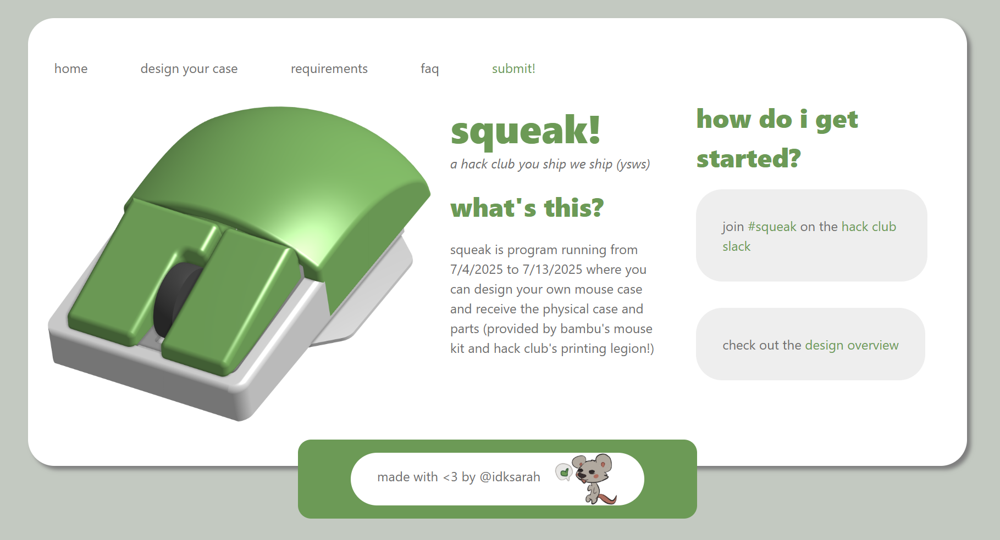

# squeak!
squeak.hackclub.com

contains website and cad files for squeak, a hack club ysws where you can design a mouse case and receive the parts (from bambu's mouse kit) and printed case

onshape files are located in /onshape_imports . download the files and import them to onshape to use them.

# usage
clone this repo  
npm run dev

